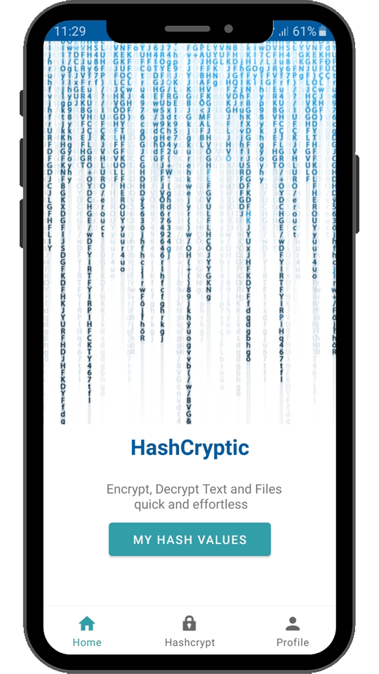
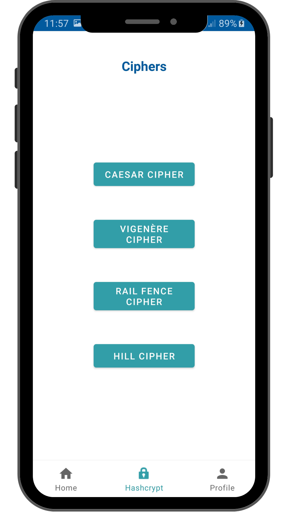
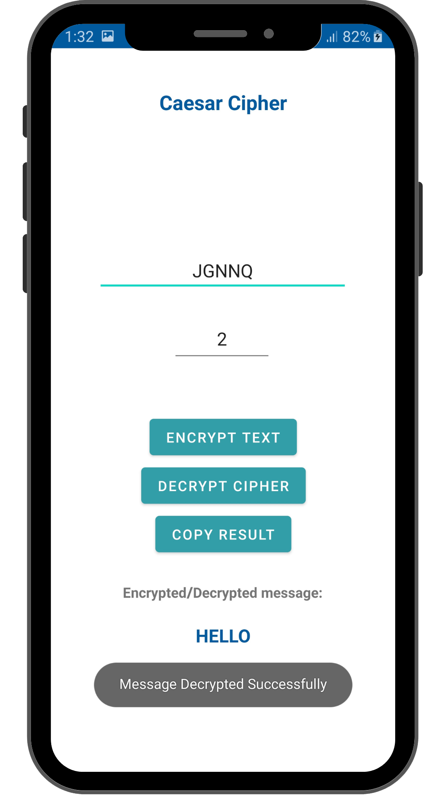
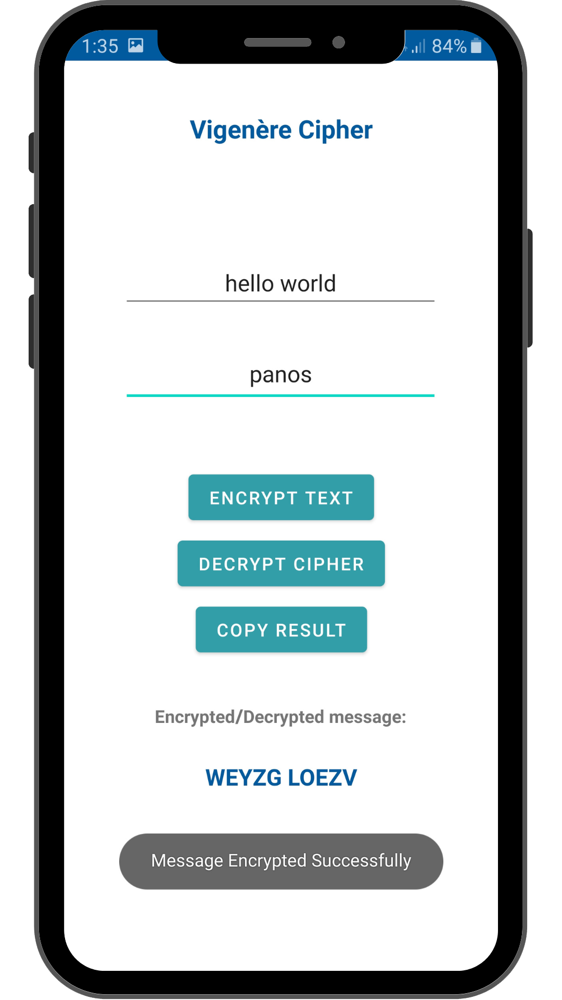
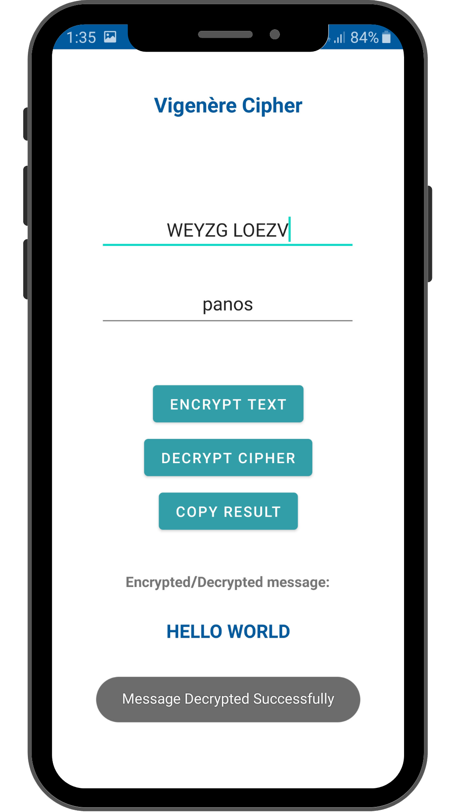
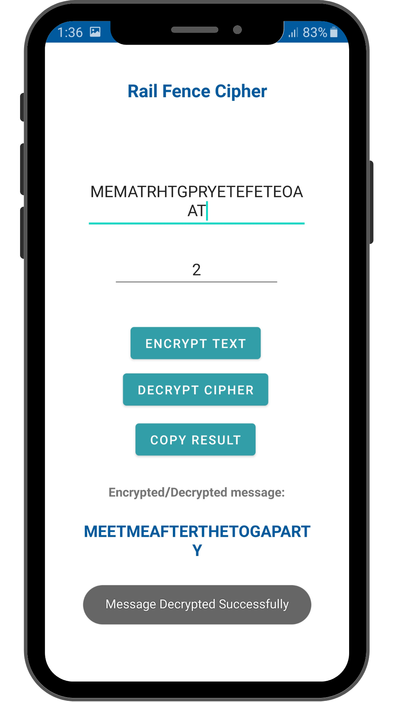
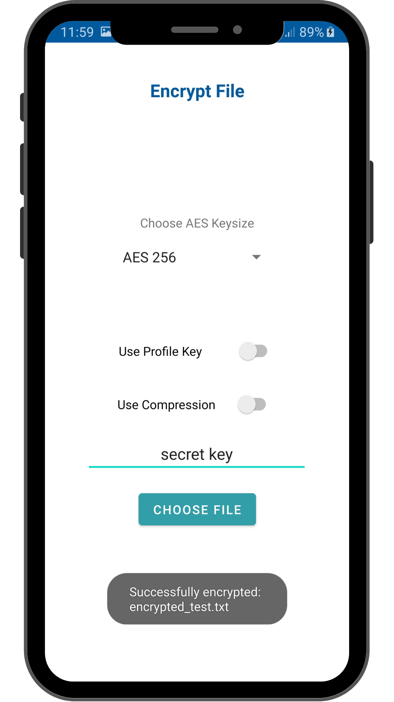

# HashCryptic
Author: Panagiotis Bampilis

## Description of the project
"HashCryptic" is a project that aims to let the user encrypt and decrypt text messages and files, easy, efficiently and effortless by using any of the provided hashing algorithms.

## Technology Selection

### Front-end
|     Technology     |        Description        |                Official website                |
| :----------------: | :----------------------:  | :--------------------------------------------: |
|        Java        | Java Programming Language |               https://www.java.com/en/         |

### Back-end
|     Technology     |        Description        |                Official website                |
| :----------------: | :----------------------:  | :--------------------------------------------: |
|        Java        | Java Programming Language |               https://www.java.com/en/         |
|        ROOM        |    Room Android Database  | https://developer.android.com/jetpack/androidx/releases/room |

### Software Testing
|    Technology    |        Description        |                Official website                |
|:----------------:|:-------------------------:| :--------------------------------------------: |
| Android Espresso | Reliable Android UI tests |               https://developer.android.com/training/testing/espresso         |

# Screenshots
 
Encrypt, Decrypt any text in no time
  

  </img>

 
Setup your profile to give a personal touch
  

  </img>
  </img>
  </img>

 
Encrypt and decrypt by exploring sophisticated ciphers
  

  </img>
  </img>
  </img>

 
Explore more ciphers
  

  </img>
  </img>
  </img>

  </img>
  </img>

 
Encrypt and decrypt any text in different hash algorithms
  

  </img>
  </img>
  </img>

 
View and manage all stored hash values, share with QR Code
  

  </img>
  </img>

 
Generate Checksum values for files
  

    </img>

 
Encrypt and decrypt files using a secret key or a personalized key generated by your profile details
  

    </img>
    </img>

 
